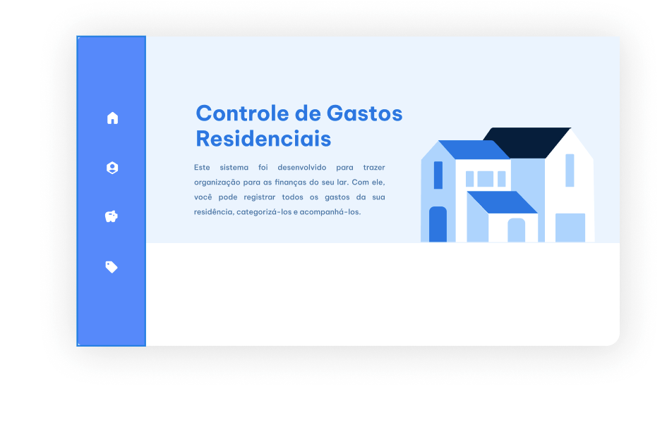

## Sistema de Controle de Gastos Residenciais



## Arquitetura e Design System
Não usei DDD (Domain Driven Design)
Devido ao domínio da aplicação ser simples e com pouca complexidade optei por não utilizar DDD. Em contrapartida utilizei o conceito de camadas de Clean Architecture divindo o backend e a API em camadas com
- Models: Representa as entidades da aplicação: Finalidade, Transacao, Pessoa, Categoria
- Repositories: Responsável pela camada de acesso direto do banco de dados
- Interfaces: Contrato de dados, para dar mais segurança para ao acesso aos dados 
- Controllers: Representa os controladores que vão tratar as requisções e respostas e definirem os endpoints da API
- Services: Representa classes que vão aplicar regras de negócio antes de chamar o repository
A api usa o padrão RESTfull.
___
No front end utilizei a arquitetura FSD (Feature Sliced Design) que estabelece que o front-end não deve ser dividido em Components pela rigidez de escalabilidade e dificuldade de manutenção. Mas sim no conceito de camadas e o principio de Responsabilidade Única do SOLID 
- Assets: São os ativos globais, fonts, estilos, imagens
- Pages: Representam as páginas maiores da aplicacação 
- Features: Representam ações do usuário, funcionalidads da aplicacação
- Entities: representam os dados puros vindo da API, a pasta /api concentra o arquivo responsável pelas chamadas de API  e a /types representa o contrato que esses dados devem seguir
- Shared: Reutilizáveis para a aplicação

## Infraestura e Deploy 
Na infraestrutura utilizei o 
- Docker e o docker-compose: Para conteinerizar a ApiFinancial, o frontend e o banco de dados Postgresql.

## Banco de Dados
No banco de dados dei preferência para o Postgresql, pela fácil aderência ao Entity Framework Core do .NET, para bancos relacionais. 
Nas regras de tabelas, o Id da tabela Transacao, coloquei ele para gerar automaticamente pelo tipo UUID. As outras tabelas coloquei como auto increment inteiros e sequenciais.
Definir regra para a coluna valor da tabela Transacao só receber valores positivos e os limites de caracteres para a coluna nome da tabela Pessoa e descricao para tabela Transacao e Categoria.

## Front-End e Back-End
Conforme solicitado no Teste, as tecnologias utilizadas foram C#/.NET 10 para o back end e a API, e no front React e Vite + Typescript.

## Executando o Projeto
1. Baixe e Instale o Git, Docker e o docker-compose na sua máquina 
2. Digite no terminal do Windows ou Linux `git clone https://github.com/carlosmaciel272/ControleDeGastosResidenciais.git` para clonar o projeto 
3. Entre na pasta /ControleDeGastosResidenciais pelo terminal digite isso `cd ControleDeGastosResidenciais`
4. Para os próximos passos é importante que o serviço do `docker` esteja em execução, se você estiver no linux digite no terminal: `sudo systemctl start docker` 
5. Ele vai pedir a senha do seu usuário root
6. Agora dentro da pasta ControleDeGastosResidenciais digite no terminal `sudo docker compose up --build` Observação: Nesta etapa ela demora de 20 a 30 minutos para construir o container, então só aguarde
7. Depois se aparecer essa mensagem: Então o você já pode acessar a aplicação
```
 Image financialcontrol-api            Built                                                                                                                                             19.8s
 ✔ Image financialcontrol-frontend       Built                                                                                                                                             19.8s
 ✔ Network financialcontrol_default      Created                                                                                                                                           0.0s
 ✔ Volume financialcontrol_postgres_data Created                                                                                                                                           0.0s
 ✔ Container controle_financas_db        Created                                                                                                                                           0.1s
 ✔ Container controle_financas_api       Created                                                                                                                                           0.0s
 ✔ Container controle_financas_front     Created  
```
8. Abra o navegador e cole isso no endereço do site: 
```
http://localhost:5173
```
Pronto, o projeto já está no ar!

